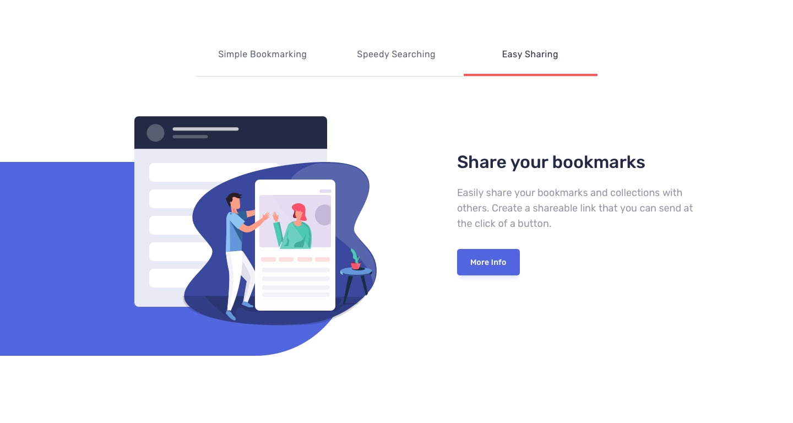
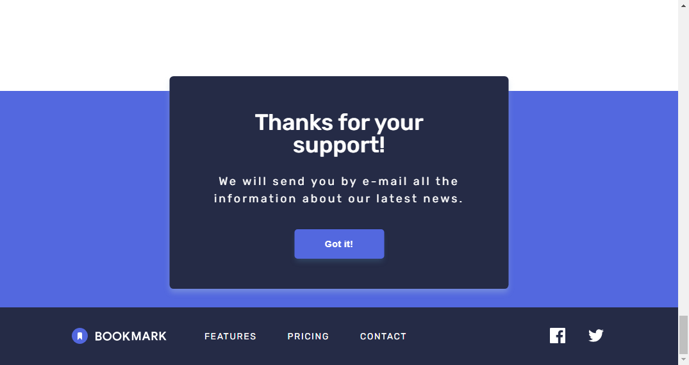

# Frontend Mentor - Bookmark landing page solution

This is a solution to the [Bookmark landing page challenge on Frontend Mentor](https://www.frontendmentor.io/challenges/bookmark-landing-page-5d0b588a9edda32581d29158). Frontend Mentor challenges help you improve your coding skills by building realistic projects.

### The challenge

Users should be able to:

- View the optimal layout depending on their device's screen size
- See hover and focus states for interactive elements

### Screenshots

- Desktop view

- Mobile view

### Links

- [Fron End Mentor solution](https://www.frontendmentor.io/solutions/bookmark-landing-page-solution-react-klbB93lw3M)
- [Live site](https://bookmark-landing-page-react.vercel.app/)

### Built with

  
  
  

## Author

- Linkedin - [Agustin Emanuel Sanchez](https://www.linkedin.com/in/agustin-emanuel-sanchez-4b2807240/)
- Frontend Mentor - [@agusscript](https://www.frontendmentor.io/profile/agusscript)
- CodePen - [Agustin Sanchez](https://codepen.io/agusscript)
- Twitter - [@agus_script](https://twitter.com/agus_script)
